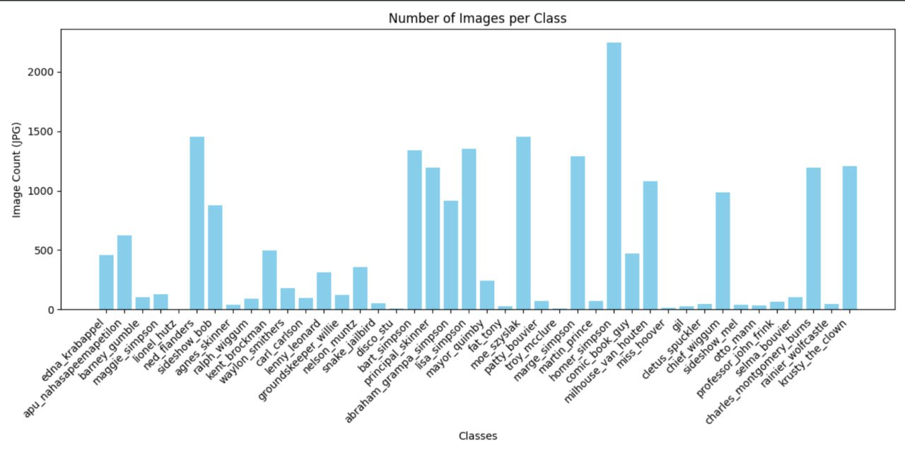
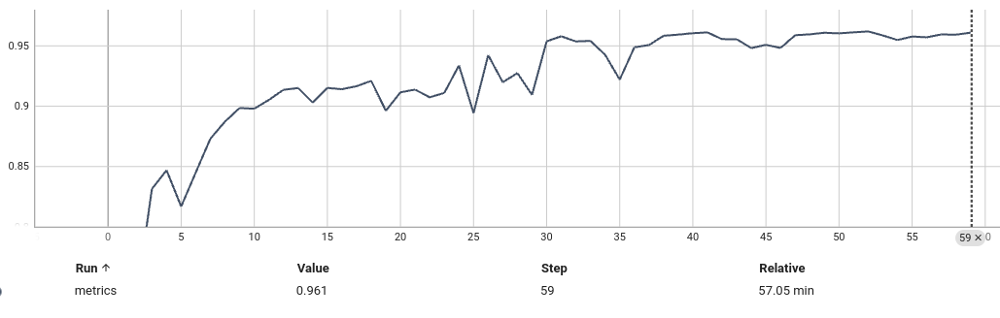

# Classification-of-the-Simpsons

My first computer vision project is the Classification of the Simpsons. The idea of the task was taken from the competition https://www.kaggle.com/datasets/alexattia/the-simpsons-characters-dataset. 

## Dataset

The dataset offered in the competition is severely unbalanced. Some classes have 3 pictures. 



There have been attempts to train a model on such data, but it is virtually impossible to test such a model because it would not be possible to separate it into a validation and training sample for each class.

Balancing the dataset with only augmentation is not a good idea because training will be the same as validation. It will not allow to evaluate the model's ability to classify simpsons in other scenes, and will not help to detect overfitting.

Therefore, new images were found for each class. A minimum of 80 images for training and 20 for validation. Then the set was augmented to 1163 for training and 290 for validation for each class. As a result, we obtained a balanced dataset in which the images with validation are different from the training images.

it's been published on Google drive and can be downloaded using command.

```bash 
pip install gdown
gdown --folder https://drive.google.com/drive/folders/10ET4wN898yG2oiRshYxTH95p-Dpoor1S?usp=sharing
tar -xJf ./simpsons_dataset/dataset.tar.xz
```

## Model

So you don't have to figure out the code, I'm publishing the model.

```python
class ResidualBlock(nn.Module):
    def __init__(self, in_channels, out_channels, stride=1, projection=False):
        super().__init__()

        self.conv1 = nn.Sequential(
            nn.Conv2d(in_channels, out_channels, kernel_size=3, stride=stride, padding=1),
            nn.BatchNorm2d(out_channels),
            nn.ReLU()
        )

        self.conv2 = nn.Sequential(
            nn.Conv2d(out_channels, out_channels, kernel_size=3, stride=1, padding=1),
            nn.BatchNorm2d(out_channels)
        )

        self.relu = nn.ReLU()

        self.projection = nn.Sequential(
            nn.Conv2d(in_channels, out_channels, kernel_size=1, stride=stride),
            nn.BatchNorm2d(out_channels)
        ) if projection else None

    def forward(self, x):
        residual = x
        out = self.conv1(x)
        out = self.conv2(out)

        if self.projection:
            residual = self.projection(residual)

        out += residual
        out = self.relu(out)
        return out


class Model(nn.Module):
    def __init__(self, n_classes=42):
        super().__init__()

        self.conv1 = nn.Sequential(
            nn.Conv2d(3, 64, kernel_size=5, stride=2, padding=3),
            nn.BatchNorm2d(64),
            nn.ReLU(),
        )

        self.block1 = ResidualBlock(64, 64)
        self.block2 = ResidualBlock(64, 64)
        
        self.block3 = ResidualBlock(64, 128, stride=2, projection=True)
        self.block4 = ResidualBlock(128, 128)
        
        self.block5 = ResidualBlock(128, 256, stride=2, projection=True)
        self.block6 = ResidualBlock(256, 256)
        
        self.avgpool = nn.AdaptiveAvgPool2d((1, 1))
        
        self.fc = nn.Sequential(
            nn.Linear(256, 512),
            nn.BatchNorm1d(512),
            nn.Dropout(0.5),
            nn.ReLU(),
            nn.Linear(512, n_classes))
        

    def forward(self, x):
        x = self.conv1(x)        
        
        x = self.block1(x)       
        x = self.block2(x)       
        
        x = self.block3(x)       
        x = self.block4(x)       
        
        x = self.block5(x)       
        x = self.block6(x)       

        x = self.avgpool(x)      
        x = x.view(x.size(0), -1)
        x = self.fc(x)           
        
        return x
```

There have been many other attempts, starting with AlexNet, to understand how different architectures behave. Eventually I went through the evolution of ImageNet and came to the residual network

## Loss
Focal loss is used instead of cross entropy. This gave some increase in accuracy.

$$ \mathcal{L}_{\text{focal}}(p) = -\alpha \cdot (1 - p)^{\gamma} \cdot \log(p) $$

## Metrics

To see in detail the metrics, the distribution of weights on each layer, the gradients, you can clone the repository and run:

``` bash
git clone https://github.com/IlyaKarakulin/Classification-of-the-Simpsons.git
cd Classification-of-the-Simpsons
tensorboard --logdir=meta_data
```

Graph for F1 on validation, which you can see in the tensorboard:


The best F1 on validation is 0.96. This is the average of the classes.

In the file img/metric_on_test.png you can see the precision, recall and F1 for each class on the test sample. They are higher than in validation because augmentation is easier in testing.

## Conclusion

Don't judge harshly, this is my first deep learning and computer vision project. I will be glad if this material will be useful for you 